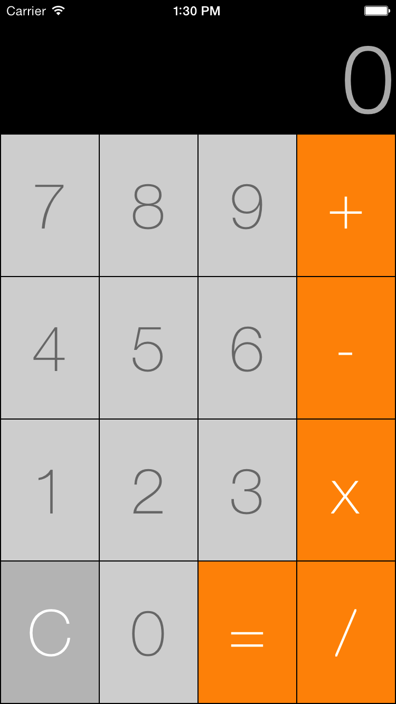

# Calculator
This is a simple calculator app.

The user can enter a maximum of 9 numbers. If any operations result in a number longer than 9 digits, it will be output in scientific notation

### Screenshot

### Works on
The app is written in Swift 3, so it should run on any device running iOS 8 or later.

### Artwork
App icon is from http://www.iconarchive.com
