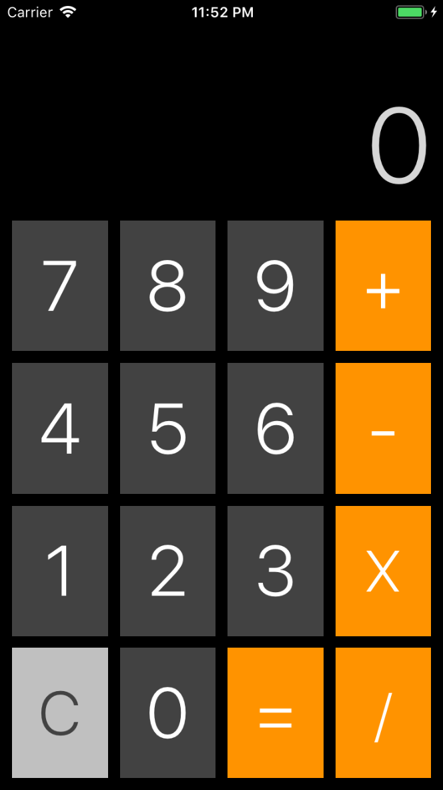

# Calculator
This is a simple calculator app.

The user can enter a maximum of 9 numbers. If any operations result in a number longer than 9 digits, it will be output in scientific notation.

### Screenshot

### Works on
The app is written in Swift 4, and should run on most devices running iOS 9 or later, with some potential exceptions, as some features may not be available in versions before iOS 11.

### Artwork
App icon is from http://www.iconarchive.com
